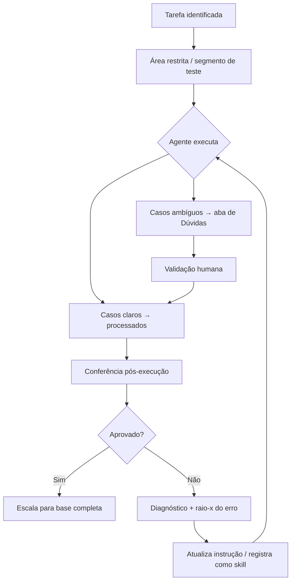

# Case 01 — Agentes de IA no CRM com humano no loop

## Contexto

Scale-up de energia com operação de CRM intensiva: atualizações de cadastro, classificação de registros, segmentação de base e comunicações segmentadas eram feitas manualmente. Com o crescimento do canal de parcerias (+208% de clientes), o gargalo humano nas operações ficou inviável de manter.

A alternativa óbvia — automatizar tudo — carrega o risco oposto: decisões erradas em massa, dados corrompidos e custo desnecessário de disparo. Era preciso um modelo que combinasse velocidade de automação com controle humano real.

## Problema

Duas forças em tensão:
- **Automatizar de menos** → gargalo humano, escala impossível.
- **Automatizar de forma cega** → erros em massa, dados corrompidos, custo desnecessário.

A solução precisava escalar o trabalho repetitivo sem abrir mão de controle, qualidade e rastreabilidade.

## Solução — Arquitetura de governança com IA

O modelo usa Claude (via aplicativo de trabalho agêntico + extensão de navegador) operando sobre o CRM, com **humano no loop** em todas as etapas críticas.

**Cinco princípios operacionais:**

**1. Área restrita e segura.**  
O agente nunca atua direto sobre a base inteira. O trabalho começa isolado em uma lista ou segmento de teste — qualquer efeito fica contido e reversível antes de escalar.

**2. Instrução step-by-step.**  
A instrução para a IA é objetiva, sequencial e concisa. Cada passo é descrito de forma que o resultado seja verificável, em vez de um pedido amplo e ambíguo que deixa espaço para interpretações erradas.

**3. Aba de "Dúvidas" para casos ambíguos.**  
O agente não decide sozinho o que é incerto. Casos ambíguos são separados em uma área de dúvidas e encaminhados para validação humana antes de seguir. Só o que é inequívoco é processado automaticamente.

**4. Conferência pós-execução.**  
Depois de rodar, o resultado passa por revisão humana antes de ser considerado concluído. "Rodou" não é o mesmo que "está certo".

**5. Disciplina de custo e escala.**  
Antes de qualquer disparo em volume, a base é filtrada para reduzir o alcance ao público de fato relevante — eliminando custo e ruído desnecessários.

**6. Raio-x de erros — transformar falhas em prevenção.**  
Quando o agente comete um erro, o diagnóstico não para em "corrigi e segui". O erro é analisado: por que aconteceu, em que tipo de instrução ou caso ambíguo, e o que mudaria na instrução para evitar que se repita. O aprendizado é registrado como padrão — uma espécie de skill interna — que passa a guiar execuções futuras do mesmo tipo. Com o tempo, o conjunto de erros mapeados funciona como um protocolo vivo de boas práticas, calibrado pela experiência real em vez de teoria.

## Resultado quantificado

- Tarefas manuais de CRM passaram a rodar de forma assistida por IA com supervisão humana.
- **Zero dados corrompidos** em operações conduzidas com este padrão.
- Na campanha do 2º trimestre: aplicação do filtro de inativos gerou **~49% de economia** nos disparos (290 → 143 parceiros selecionados).
- Liberação de tempo para trabalho estratégico, mantendo qualidade de dados e rastreabilidade.

## Aprendizados

- **A área restrita não é burocracia** — é o que torna a automação segura para escala. Sem ela, o primeiro erro é também o maior.
- **Casos ambíguos são ouro.** A aba de dúvidas não é um defeito do processo; é o ponto onde o modelo aprende com o humano o que não estava explícito na instrução.
- **Instrução vaga = resultado imprevisível.** A qualidade do output do agente é diretamente proporcional à qualidade da instrução. Iterar na instrução antes de escalar é mais barato do que corrigir depois.
- O mesmo padrão serve para limpeza de base, atualização de status, campanhas segmentadas e migração de processos entre áreas.
