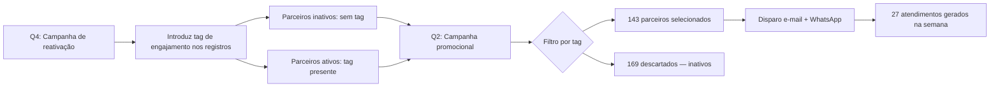

# Case 02 — Campanha segmentada: 49% de economia com filtro de base prévia

## Contexto

Campanha promocional do 2º trimestre para o canal de parcerias de energia solar compartilhada (geração distribuída). O objetivo era comunicar as ofertas da temporada para parceiros nas etapas "aceito" e "indicação realizada" do pipeline.

Antes de disparar, havia uma decisão a tomar: enviar para toda a base elegível (290 parceiros) ou filtrar primeiro.

## Problema

Bases de CRM acumulam inativos. Disparar para toda a base elegível gera três problemas simultâneos:

1. **Custo desnecessário** — ferramentas de e-mail e WhatsApp cobram por envio.
2. **Ruído operacional** — suporte recebe dúvidas de parceiros que não estavam ativos há meses.
3. **Qualidade de dados** — métricas de campanha distorcidas por um público que não vai converter.

O desafio era ter um sinal confiável de inatividade para usar como filtro — sem fazer uma análise manual de 290 registros.

## Solução — Reaproveitamento de marcação criada em Q4

Na campanha de reativação do Q4, foi introduzida uma marcação para separar parceiros engajados dos inativos — com a intenção explícita de que essa tag servisse como filtro em ações futuras.

No Q2, ao preparar a campanha promocional, a marcação foi reaproveitada como critério de segmentação:
- Base elegível inicial: **290 parceiros** (etapas "aceito" e "indicação realizada")
- Após filtro de inativos: **143 parceiros selecionados**
- Removidos: **169 parceiros** sem tag de engajamento

Disparo executado via HubSpot Workflows (e-mail) e Wati (WhatsApp), com templates personalizados por segmento.

## Resultado quantificado

| Métrica | Valor |
|---------|-------|
| Base elegível inicial | 290 parceiros |
| Base filtrada (enviado) | 143 parceiros |
| Inativos removidos | 169 |
| **Economia nos disparos** | **~49%** |
| Atendimentos gerados na semana | 27 chats |

A economia de 49% foi real — não uma estimativa. É o delta direto entre o que seria disparado sem o filtro e o que foi efetivamente enviado.

## Aprendizados

- **Instrumentar a base enquanto se trabalha nela** tem retorno composto. A marcação do Q4 não custou quase nada de implementar — mas rendeu 49% de economia no Q2 sem esforço adicional.
- **Filtrar antes de disparar é uma decisão de custo e qualidade**, não apenas de segmentação. Uma campanha menor e mais precisa gera menos ruído operacional e métricas mais confiáveis.
- O volume de atendimentos gerados (27 chats) foi gerenciável justamente porque a base foi qualificada. Com 290 parceiros, o número seria proporcionalmente maior — e com menor taxa de conversão esperada.
- **Documentar a lógica do filtro** é tão importante quanto criar o filtro. Se a tag não estivesse descrita no inventário de automações, não seria encontrada no Q2.
