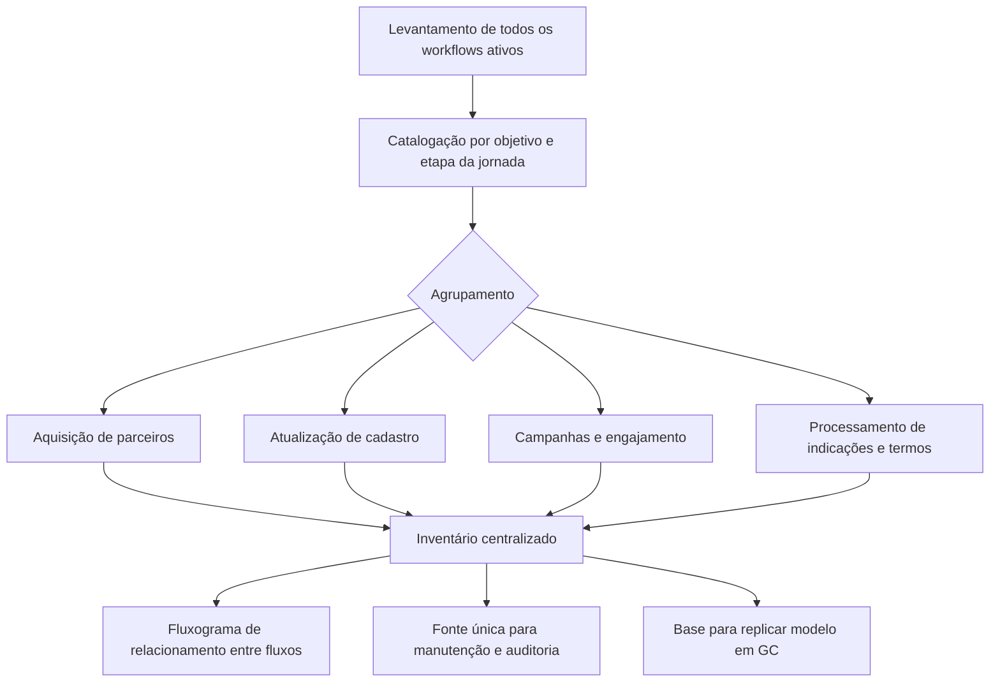

# Case 03 — Documentação reprodutível: 41 workflows mapeados

## Contexto

O programa de parcerias de energia solar operava com dezenas de fluxos de automação no CRM — desde a inscrição do parceiro via landing page até o processamento de indicações e campanhas de engajamento. Cada fluxo havia sido criado em momentos diferentes, por necessidades distintas, sem um registro centralizado.

O resultado prático: ninguém sabia exatamente quantos fluxos existiam, o que cada um fazia, como se conectavam ou o que aconteceria se um fosse alterado.

## Problema

Operação crescendo, time enxuto, automações acumuladas sem documentação:
- Risco de alterações que quebram fluxos dependentes sem perceber.
- Conhecimento concentrado em uma pessoa — risco de saída.
- Impossibilidade de auditar o que está ativo, o que está obsoleto, o que se sobrepõe.
- Onboarding de novos membros de time inviável sem guia.

## Solução — Inventário vivo de automações

Cada fluxo foi catalogado com:
- **Objetivo:** o que ele faz e por que existe.
- **Etapa da jornada:** onde atua no funil do parceiro.
- **Gatilho:** o que dispara a execução.
- **Frequência:** contínuo, pontual, periódico.

O inventário foi complementado com um fluxograma de relacionamento entre os fluxos (em ferramenta de design), mostrando dependências e sequências.

**Agrupamentos principais:**

| Grupo | Escopo |
|-------|--------|
| Aquisição | Inscrição via landing page, agendamento, termo de compromisso, boas-vindas, apresentação assíncrona do programa com follow-ups |
| Atualização de cadastro | Status ativo/inativo/churn, nível por volume de indicações, datas de primeira e última indicação, associação contato–empresa, origem |
| Campanhas | Bônus de 1ª indicação, divulgação de treinamentos, parabenização por novo nível |
| Processamento | Assinatura de termo, atualização de pipeline, criação de tarefas de acompanhamento |

Total mapeado: **41 fluxos de automação**.

O modelo foi depois replicado para a área de Gestão de Clientes (GC), gerando um inventário equivalente com os fluxos dessa operação.

## Resultado quantificado

- **41 workflows** documentados em inventário único, consultável e auditável.
- Dependências entre fluxos mapeadas visualmente — alterações com visibilidade de impacto.
- Modelo replicado para GC sem custo adicional de estruturação.
- Base para o plano de encerramento do programa: inventário foi a fonte para identificar quais fluxos desativar e em qual ordem.

## Aprendizados

- **Documentação como produto, não como tarefa.** O inventário só tem valor se for consultado. Estruturá-lo por agrupamento e etapa da jornada — e não só por ordem de criação — é o que o torna utilizável.
- **Fluxograma de relacionamento é diferente de lista.** A lista diz o que existe; o fluxograma diz como os fluxos dependem uns dos outros. Os dois juntos permitem auditoria real.
- **Documentar em tempo real é mais barato do que reconstruir depois.** Quando o programa foi encerrado, o inventário já existia — o plano de desativação foi derivado diretamente dele, sem levantamento adicional.
- **Replicabilidade é um critério de design.** A estrutura do inventário foi pensada para ser aplicada em outra área sem redesenho — o que permitiu a adoção pelo time de GC.
